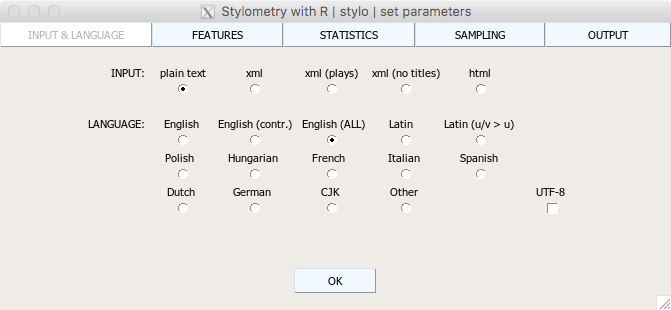
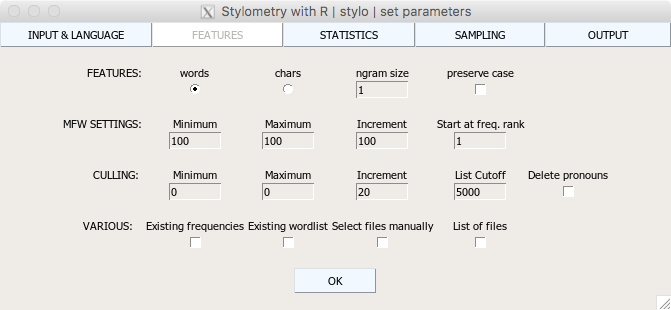
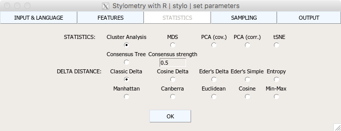
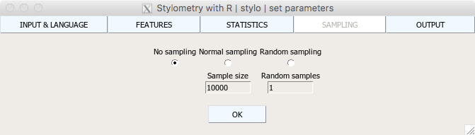
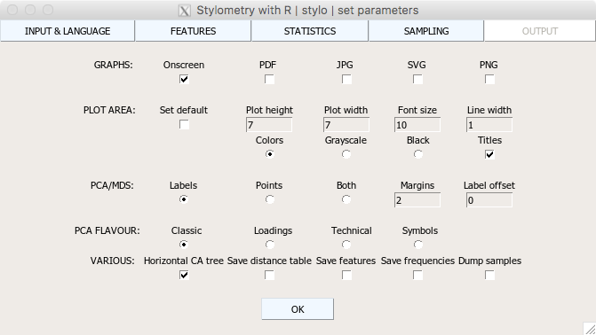

# Stylometry with the package stylo

## Disclaimer

This crash tutorial introduces basic functions of the package `stylo`, in oder 
to help  the users start their experiments in no time. Essentially this means that 
no theoretical background will be provided. Also, the discussion on the functionalities 
of the package  `stylo` will be reduced as much as possible. For more details, 
please refer to the following resources:

* a tutorial
* paper in R Journal
* full documentation at CRAN

## Installing `stylo`

* run R
* type `install.packages("stylo")`
* pick your R server
* click `OK`
* done!

## Some basic R functions, just in case

* to activate a package: `library(stylo)`
* to set working directory: `setwd("path/to/my/stuff")`
* to find your current location: `getwd()`
* to list files in your current location: `list.files()`
* to get help: `help(<function>)`, e.g. `help(stylo)`
* to quit R: `q()`

## Main functions: `stylo()`

* It computes distances (differences) between texts, ...
* ... represented as rows of frequencies of most frequent words.
* Then it plots graphs of those distances:
    * **Cluster Analysis** plots (dendrograms)
    * **Multidimensional Scaling** scatterplots
    * **Principal Components Analysis** scatterplots
    * **Bootstrap Consensus Trees** plots (for multiple parameter settings)
    * **Bootstrap Consensus Networks** (other software will be needed to take over)
* The plots can be both displayed on screen and saved to a file (e.g. PNG).

## Main functions: `classify()`

* It trains a model for pre-defined groups of texts, e.g. authors.
* Then it computes distances (differences) between texts, ...
* ... represented as rows of frequencies of most frequent words.
* Finally, it compares the trained models with test texts, using:
    * **Delta** classifier (lazy learner introduced by Burrows)
    * **k-NN** classifier (lazy learner relying on >1 neighbors)
    * **Suppor Vector Machines**, a high-performance non-probabilistic classifier
    * **Naive Bayes**, a classical yet slightly outdated classifier
    * **Nearest Shrunken Centroids**, a classifier for high-dimensional datasets
* A final report of the classifier’s performance is outputted.

## Main functions: `oppose()`

* Designed to compare two (groups of) texts
* It cuts input texts into equal-sized samples
* Finds words characteristic for two (groups) of texts
    * These can be reused with `stylo()` or `classify()`
* Produces a diagram of the use of each group’s words

## Functions: `rolling.classify()`

* Looks for traces of authors in a co-authored text...
* ... by sliding through this text sequentially in order to detect peculiarities.
* Produces a graph of the respective strengths of these traces.

## Preparing a corpus

* 
* in your favourite folder, create a subfolder named `corpus`
* put your raw text files there, e.g.:
    * `Shakespeare_Hamlet.txt`
    * `Kyd_Tragedy.txt`
    * etc.

## Running `stylo()`

1. activate the package 
    * type `library(stylo)`, hit ENTER
2. navigate to your favourite folder:
    * geeks: `setwd("the/path/to/my/favourite/folder")`
    * RStudio users: find your directory in the **Files** panel, then 
      use **Menu > More > Set as Working Directory**
    * Windows users: use **Menu > File > Change directory**
    * MaxOS users: use **Menu > Misc > Change working directory**
3. launch the main function: 
    * type `stylo()`, hit ENTER

## `stylo()` parameters

* INPUT: state your txts’ format
* LANGUAGE: self-evident
* Don’t press OK yet!

{width=500px}

## `stylo()` parameters

* FEATURES: things to count: words or characters
    * ngram size: say 1 for single features, 2 for 2-grams, etc.
* MFW SETTINGS: how many most frequent words to use
    * in most cases, `Minimum = Maximum`

{width=500px}

## `stylo()` parameters

CULLING: MANIPULATING THE WORDLIST (0)
0%: NO WORDS ARE REMOVED
100%: ALL WORDS ARE REMOVED THAT DO NOT OCCUR IN ALL THE TEXTS
DELETE PRONOUNS?
DON’T PRESS „OK” YET!!!

## `stylo()` parameters

STYLO() PARAMETERS
STATISTICS: PICK STATISTICS METHOD (Cluster Analysis)
DISTANCES: TYPE OF DISTANCE MEASURE (Classic Delta)
DON’T PRESS „OK” YET!!!

{width=500px}

## `stylo()` parameters

SAMPLING: (No sampling)
DO I WANT TO SAMPLE THE TEXTS
AND HOW
DON’T PRESS „OK” YET!!!

{width=500px}

## `stylo()` parameters

OUTPUT: (Onscreen)
GRAPH FORMAT ETC.
PRESS „OK”!!!
…WAIT FOR IT…

{width=500px}

## Running Gephi

* [TBD!]

RUNNING GEPHI
FIRST WE NEED TO RUN STYLO: 
It creates an OUTPUT FILE named e.g.
50 British Novels_100-1000_MFWs_Culled_100_Pronouns deleted_Classic Delta_C_0.5_EDGES.csv
SELECT GEPHI>NEW PROJECT
Data laboratory>Import Spreadsheet
Import settings:
Separation: Comma
As table: Edges table
Charset: UTF-8? Windows-1252…
Next

RUNNING GEPHI
Select ALL available options
FINISH!
We need to get authors’ names...
Click

And set:
OK!
Copy ID column to LABEL

RUNNING GEPHI
PREVIEW
PARTITION
CLICK
SELECT: e.g. Author
Apply
Show labels
LAYOUT
ForceAtlas 2
Dissuade Hubs
Prevent Overlap
Edge Weight Influence 0.5
Scaling: 500
RUN!
LAYOUT (CONT)
Expansion
RUN!

RUNNING GEPHI
OVERVIEW
NODE LABELS
SHOW LABELS
EDGES
SHOW EDGES
Thickness: np. 0.1, 0.01...
REFRESH!
Reset zoom
SAVING
NETWORK:
File > Save
WITH .gephi EXTENSION
PICTURE:
File > Export > SVG/PDF/PNG
Options > Landscape
PHEW!

RUNNING OPPOSE
DIFFERENT SUBFOLDER STRUCTURE:
`primary_set`
`secondary_set`
`test_set` (optional)
`library(stylo)` <ENTER>
`oppose()` <ENTER>
What we get:
`WORDS_PREFERRED` characteristic for the primary_set texts
`WORDS_AVOIDED` characteristic for the secondary_set texts
word frequency graph

OPPOSE() PARAMETERS
Slice length: size (in words) of the samples (5000)
Slice overlap: (0)
Method: (Craig’s Zeta)
Visualization: type of graph (Markers)

RUNNING ROLLING.CLASSIFY
DIFFERENT SUBFOLDER STRUCTURE (AGAIN):
reference_set (individual writings)
test_set (collaborative text)
`library(stylo)` <ENTER>
`rolling.classify(write.png.file = TRUE, classification.method = "delta", mfw = 100, training.set.sampling = "normal.sampling", slice.size = 5000,slice.overlap = 4500)`
What we get:
Similarity graph

